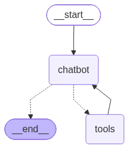
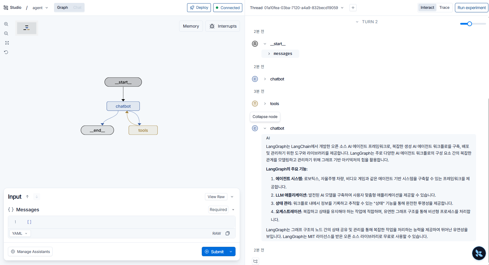

# 랭그래프로 웹 검색 에이전트 만들기

6.2.2에서는 `bind_tools()`로 연결한 LLM이 "이 도구를 이 인자로 실행해 달라"는 `tool_calls`만 만들고, 실제로 도구를 실행하지는 않았다. 이번에는 **도구를 실행하고, 그 결과를 다시 LLM에게 돌려주는 반복**을 랭그래프로 만든다. 그래프를 여러 방법으로 실행해 보고(6.2.4), 랭그래프 서버를 띄워 LangSmith Studio에서 실행 과정을 눈으로 확인했다(6.2.5).

- 코드: [`web_agent.py`](web_agent.py) (노트북이 아니라 `.py` 파일. 랭그래프 서버가 이 파일의 `graph` 변수를 불러간다)
- 서버 설정: [`langgraph.json`](langgraph.json)

| 구성 요소 | 역할 |
|---|---|
| `chatbot` 노드 | 대화 전체를 LLM에 보내고, 답변 또는 도구 실행 요청(`tool_calls`)을 받는다 |
| `tools` 노드 (`BasicToolNode`) | `tool_calls`에 적힌 도구를 실제로 실행하고 결과를 `ToolMessage`로 대화에 추가한다 |
| `route_tools` (조건부 엣지) | 마지막 메시지에 `tool_calls`가 있으면 `tools`로, 없으면 종료 |

## 1. 도구와 LLM 준비

타빌리 검색 도구를 만들고 LLM에 연결한다. 여기까지는 6.2.2와 같다.

```python
from langchain_openai import ChatOpenAI 
from langchain_tavily import TavilySearch 

# 웹 검색 도구: 검색 결과를 최대 3개까지 가져온다.
tool = TavilySearch(max_results=3)
# LLM에 연결할 도구 목록
tools = [tool] 

# 답변 생성과 도구 사용 여부 판단을 맡는 LLM
llm = ChatOpenAI(model="gpt-4o")
# LLM에 도구 설명서를 연결 (LLM은 tool_calls로 '실행 요청'만 만들고, 실제 실행은 tools 노드가 한다)
llm_with_tools = llm.bind_tools(tools)
```

## 2. 상태와 chatbot 노드

상태는 메시지 목록 하나이고, `add_messages` 리듀서로 새 메시지가 계속 뒤에 쌓인다. 6.2.2까지는 질문을 문자열로 다뤘지만, 이제 `messages`에는 `HumanMessage`, `AIMessage`, `ToolMessage` 같은 메시지 객체가 들어간다. 실행할 때 `{"messages": ["Langgraph가 무엇인가요?"]}`처럼 문자열을 넣어도 `add_messages`가 `HumanMessage`로 바꿔준다.

`chatbot` 노드는 **지금까지의 대화 전체**를 LLM에 보낸다. 그래서 두 번째로 호출될 때는 질문, 도구 실행 요청, 검색 결과가 모두 들어간 상태에서 답을 만든다.

```python
from typing import TypedDict, Annotated 

from langgraph.graph import StateGraph, START, END 
from langgraph.graph.message import add_messages 

# 그래프 상태: 대화 메시지 목록. add_messages 리듀서로 새 메시지가 계속 뒤에 쌓인다.
class State(TypedDict):
    messages: Annotated[list, add_messages]
    
# State 구조를 가진 그래프 설계도
graph_builder = StateGraph(State)

# chatbot 노드: 지금까지의 대화 전체를 LLM에 보내고, 응답(AIMessage)을 messages에 추가한다.
# 응답에는 최종 답변이 들어 있거나, 도구 실행 요청(tool_calls)이 들어 있다.
def chatbot(state: State):
    response = llm_with_tools.invoke(state["messages"])
    return {"messages": [response]}

# "chatbot"이라는 이름으로 노드 등록
graph_builder.add_node("chatbot", chatbot)
```

## 3. 도구 실행 노드 (BasicToolNode)

LLM이 만든 `tool_calls`를 실제로 실행하는 노드다. 마지막 `AIMessage`의 `tool_calls`를 하나씩 꺼내서, 이름으로 도구를 찾고, LLM이 정한 인자로 실행한다. 결과는 `ToolMessage`로 감싸는데, `tool_call_id`에 요청의 `id`를 넣어야 LLM이 "어떤 요청에 대한 결과인지"를 맞춰볼 수 있다.

랭그래프에는 같은 일을 하는 `ToolNode`(`from langgraph.prebuilt import ToolNode`)가 이미 있다. 여기서는 내부 동작을 이해하려고 직접 만들었다.

```python
import json 
from langchain.messages import ToolMessage 

# 도구 실행 노드: LLM이 요청한 tool_calls를 실제로 실행하고 결과를 ToolMessage로 돌려준다.
# (랭그래프의 ToolNode를 직접 만들어 보는 버전)
class BasicToolNode:
    """
        마지막 AIMessage에서 요청한 도구를 실행하는 노드
    """
    
    def __init__(self, tools: list) -> None: 
        # 도구 이름 -> 도구 객체 (LLM이 요청한 이름으로 도구를 찾기 위함)
        self.tools_by_name = {tool.name: tool for tool in tools}
        
    def __call__(self, inputs: dict):
        # 마지막 메시지(= chatbot이 방금 만든 AIMessage)를 꺼낸다.
        if messages := inputs.get("messages", []):
            message = messages[-1]
        else:
            raise ValueError("ERROR: 입력에 메시지가 없습니다.")
        
        outputs = [] 
        # LLM이 요청한 도구 호출을 하나씩 실행 (한 번에 여러 개를 요청할 수 있다)
        for tool_call in message.tool_calls:
            # 요청받은 도구를 LLM이 정한 인자(args)로 실행
            tool_result = self.tools_by_name[tool_call["name"]].invoke(
                tool_call["args"]
            )
            # 결과를 JSON 문자열로 바꿔 ToolMessage로 감싼다. tool_call_id로 어떤 요청에 대한 결과인지 표시
            outputs.append(
                ToolMessage(
                    content=json.dumps(tool_result, ensure_ascii=False),
                    name=tool_call["name"],
                    tool_call_id=tool_call["id"]
                )
            )
        # 도구 결과 메시지들을 반환 -> add_messages로 대화 뒤에 추가된다.
        return {"messages": outputs}
    
# 도구 실행 노드를 만들어 "tools"라는 이름으로 등록
tool_node = BasicToolNode(tools=[tool])
graph_builder.add_node("tools", tool_node)
```

## 4. 라우팅과 엣지: chatbot ↔ tools 반복

`chatbot`이 끝나면 `route_tools`가 마지막 메시지를 본다. `tool_calls`가 있으면 `tools`로 가서 도구를 실행하고, `tools`가 끝나면 **다시 `chatbot`으로** 돌아온다. LLM이 검색 결과를 읽고 더 이상 도구를 요청하지 않으면(최종 답변) `END`로 끝난다. 5장의 그래프는 한 방향으로만 흘렀는데, 이번 그래프는 `tools → chatbot` 엣지 때문에 **반복(루프)**이 생긴다. 이 반복이 에이전트의 핵심이다.

```python
# 라우팅 함수: 마지막 AIMessage에 도구 호출 요청이 있으면 "tools"로, 없으면(최종 답변) END로 보낸다.
def route_tools(
    state: State,
):
    """
    마지막 메시지에 도구 호출이 있는 경우, ToolNode로 라우팅하고 그렇지 않으면 END로 라우팅
    """
    if isinstance(state, list):
        ai_message = state[-1]
    elif messages := state.get("messages", []):
        ai_message = messages[-1]
    else:
        raise ValueError(f"ERROR: 입력에 메시지가 없습니다. 상태: {state}")
    
    # tool_calls가 비어 있지 않으면 도구를 실행해야 한다는 뜻
    if hasattr(ai_message, "tool_calls") and len(ai_message.tool_calls) > 0:
        return "tools" 
    return END 

# chatbot 다음은 route_tools의 반환값에 따라 tools 또는 END로 분기
graph_builder.add_conditional_edges(
    "chatbot",
    route_tools,
    {"tools": "tools", END: END}
)

# 도구 실행 결과를 들고 다시 chatbot으로 -> LLM이 결과를 읽고 답하거나, 도구를 또 요청한다 (반복)
graph_builder.add_edge("tools", "chatbot")
# 시작 -> chatbot
graph_builder.add_edge(START, "chatbot")
# 실행 가능한 그래프로 컴파일. langgraph.json이 이 graph 변수를 랭그래프 서버에 올린다.
graph = graph_builder.compile()
```

그래프 구조 (`draw_mermaid_png()`로 저장한 그림). 점선은 조건부 엣지, 실선은 일반 엣지다.



## 5. 실행 방법 비교 (6.2.4)

같은 질문(`"Langgraph가 무엇인가요?"`)을 여러 방법으로 실행해 봤다. 코드 파일 아래쪽에 방법별 코드가 주석으로 남아 있고, 하나씩 주석을 풀어서 실행했다. 지금은 마지막 `astream()`만 켜져 있다.

| 방법 | 받는 것 | 쓰임 |
|---|---|---|
| `graph.invoke()` | 끝까지 실행한 뒤의 최종 상태 (메시지 전체) | 결과만 필요할 때 |
| `msg.pretty_print()` | 위 결과를 메시지 종류(Human/AI/Tool)별로 보기 좋게 출력 | 흐름을 눈으로 확인할 때 |
| `await graph.ainvoke()` | `invoke()`의 비동기 버전 | 웹 서버처럼 여러 요청을 동시에 처리할 때 |
| `graph.stream()` (기본 `updates` 모드) | 노드가 끝날 때마다 **그 노드가 바꾼 값**만 | 어느 노드가 무엇을 했는지 단계별로 볼 때 |
| `stream_mode="values"` | 노드가 끝날 때마다 **그 시점의 상태 전체** | 상태가 어떻게 쌓이는지 볼 때 |
| `stream_mode="messages"` | LLM이 만드는 답변을 **토큰 조각** 단위로 | 챗봇 화면에 글자가 실시간으로 찍히게 할 때 |
| `graph.astream()` | `stream()`의 비동기 버전 | 비동기 환경에서 단계별 출력 |

지금 켜져 있는 코드는 `astream()`(updates 모드)이다. 노드가 끝날 때마다 `--- 노드 이름 ---`과 그 노드가 반환한 값을 출력한다. 검색이 필요한 질문이라 `chatbot`(도구 요청) → `tools`(검색 실행) → `chatbot`(검색 결과로 답변) 순서로 세 번 출력된다.

```python
# astream(): stream()의 비동기 버전 (updates 모드). 지금 켜져 있는 실행 코드
# astream()를 활용해 실행 결과 확인하기 
async def astream():
    response = graph.astream(
        {
            "messages": ["Langgraph가 무엇인가요?"]
        }
    )
    async for chunk in response:
        for node, state in chunk.items():
            print("---", node, "---")
            print(state)
            print("=" * 60)
            
if __name__ == "__main__":
    import asyncio 
    asyncio.run(astream())
```

실행:

```bash
uv run web_agent.py
```

참고로 `messages` 모드 예제의 `print(token.content)`는 토큰 조각마다 줄을 바꾼다. 한 줄로 이어서 보려면 `print(token.content, end="")`로 쓰면 된다.

## 6. 랭그래프 서버와 LangSmith Studio (6.2.5)

`langgraph.json`은 랭그래프 서버 설정 파일이다.

```json
{
    "dependencies": ["."],
    "graphs": {
        "agent": "./web_agent.py:graph"
    },
    "env": ".env"
}
```

- `graphs`: 서버에 올릴 그래프. `agent`라는 이름으로 `web_agent.py` 파일의 `graph` 변수를 불러온다.
- `env`: API 키를 읽어올 `.env` 파일 위치
- `dependencies`: 그래프 코드가 있는 경로

`ex1006` 폴더에서 개발 서버를 실행한다. (`langgraph-cli[inmem]` 패키지가 필요하다.)

```bash
uv run langgraph dev
```

서버가 뜨면 터미널에 API 주소(기본 `http://127.0.0.1:2024`)와 Studio 주소(`https://smith.langchain.com/studio/?baseUrl=http://127.0.0.1:2024`)가 나온다. Studio에서는 왼쪽에 그래프 구조가, 오른쪽에 실행 기록(Thread)이 보인다. 입력창에 메시지를 넣고 Submit 하면, 아래처럼 `__start__ → chatbot → tools → chatbot` 순서로 노드가 실행되고 마지막 `chatbot`이 검색 결과를 바탕으로 LangGraph를 설명한 답변이 나온다. 각 노드를 펼치면 그 노드가 상태에 무엇을 추가했는지 볼 수 있다.



서버를 실행하면 같은 폴더에 `.langgraph_api/` 폴더가 생긴다. 로컬 서버가 실행 기록을 저장하는 곳이라 깃허브에 올리지 않도록 `.gitignore`에 넣었다.

## 정리

| 개념 | 코드 | 핵심 |
|---|---|---|
| 도구 실행 노드 | `BasicToolNode` (`ToolNode`와 같은 역할) | `tool_calls`를 실제로 실행하고 `ToolMessage`(+`tool_call_id`)로 돌려준다 |
| 라우팅 | `route_tools` + `add_conditional_edges` | `tool_calls`가 있으면 `tools`, 없으면 `END` |
| 반복 구조 | `add_edge("tools", "chatbot")` | 도구 결과를 들고 LLM에게 다시 물어본다. 도구가 더 필요 없을 때까지 반복 |
| 실행 방법 | `invoke` / `stream`(updates·values·messages) / `ainvoke` / `astream` | 최종 결과만 받을지, 단계·상태·토큰 단위로 받을지 |
| 랭그래프 서버 | `langgraph.json` + `langgraph dev` | 그래프를 API 서버로 띄우고 Studio에서 실행 과정을 확인 |

6.2.2에서 "LLM은 실행 계획만 세운다"고 했던 부분을, 이번에 `tools` 노드와 `tools → chatbot` 반복으로 채웠다. 이게 도구를 쓰는 에이전트의 기본 구조다.
