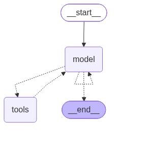

# create_agent 미들웨어와 구조화 출력

6.3에서는 `create_agent(llm, tools)`로 에이전트를 바로 만들었다. 이번에는 **미들웨어**로 에이전트가 모델을 호출하는 과정에 끼어들어 모델·프롬프트를 바꾸거나 입력을 검사하고(6.4.3), 최종 결과를 정해진 형식의 객체로 받는 **구조화 출력**(6.4.4)을 실습했다.

| 파일 | 내용 |
|---|---|
| [`create_agent/tools.py`](create_agent/tools.py) | 모든 예제가 같이 쓰는 계산기 도구 |
| [`create_agent/middleware.py`](create_agent/middleware.py) | `@wrap_model_call`: 대화 길이에 따라 모델 바꾸기 |
| [`create_agent/middleware_with_node.py`](create_agent/middleware_with_node.py) | `@before_model`: 금지어 차단 / `@dynamic_prompt`: 말투 바꾸기 |
| [`create_agent/middleware_with_runtime_context.py`](create_agent/middleware_with_runtime_context.py) | 런타임 컨텍스트(사용자 역할)에 따라 프롬프트 바꾸기 |
| [`create_agent/structured_output.py`](create_agent/structured_output.py) | `ToolStrategy`로 연락처 정보를 객체로 추출 |

이번에 쓴 미들웨어는 세 종류다.

| 미들웨어 | 언제 실행되나 | 그래프 노드 | 이번 예제 |
|---|---|---|---|
| `@wrap_model_call` | 모델 호출을 감싼다. 호출 직전에 요청을 바꿀 수 있다 | 추가 안 됨 | 모델 교체 |
| `@before_model` | 모델 호출 직전에 상태를 보고 실행된다 | `이름.before_model` 노드 추가 | 금지어 차단 |
| `@dynamic_prompt` | 모델 호출마다 시스템 프롬프트를 만든다 (`wrap_model_call` 기반) | 추가 안 됨 | 말투 / 역할별 프롬프트 |

모든 파일은 `ex1008` 폴더에서 실행했다. 실행 결과는 터미널 출력을 그대로 옮겼다.

## 0. 공통 도구 (tools.py)

```python
from langchain.tools import tool

# 계산기 도구: 이번 실습의 에이전트들이 공통으로 쓰는 도구
@tool 
def calculator(a: int, b: int, operation: str) -> str:
    """
    간단한 계산기 도구입니다.
    
    Args:
        a: 첫 번째 숫자
        b: 두 번째 숫자
        operation: 연산 종류 (add, subtract, multiply, divide)
    """
    if operation == "add":
        result = a + b
    elif operation == "subtract":
        result = a - b 
    elif operation == "multiply":
        result = a * b 
    elif operation == "divide":
        # 0으로 나누면 에러 대신 안내 문구를 결과로 돌려준다.
        result = a / b if b != 0 else "0으로 나눌 수 없습니다"
    else:
        return f"지원하지 않는 연산: {operation}"
    
    return f"{a} {operation} {b} = {result}"

# 다른 파일에서 from tools import tools로 가져다 쓴다.
tools = [calculator]
```

## 1. @wrap_model_call: 대화 길이에 따라 모델 바꾸기

모델을 호출할 때마다 지금까지 쌓인 메시지 수를 세서, 10개 이하면 `gpt-4o-mini`, 넘으면 `gpt-4o`로 바꿔서 호출한다. 계산 결과를 이어받는 질문 6개를 같은 `thread_id`로 연달아 보낸다.

```python
from dotenv import load_dotenv 

from langchain_openai import ChatOpenAI 
from langchain.agents import create_agent
from langchain.agents.middleware import wrap_model_call, ModelRequest, ModelResponse 

from tools import tools 

load_dotenv()

# 가벼운 모델(기본)과 고급 모델 두 개를 준비
basic_model = ChatOpenAI(model="gpt-4o-mini")
advanced_model = ChatOpenAI(model="gpt-4o")

# @wrap_model_call: 모델을 호출하는 순간을 감싸는 미들웨어. 호출 직전에 요청(request)을 바꿀 수 있다.
# 그래프에 노드가 추가되지 않는다. (저장한 그래프 그림이 기본 create_agent와 같다)
@wrap_model_call
def dynamic_model_selection(request: ModelRequest, handler) -> ModelResponse:
    """대화 복잡도에 따라 모델을 동적으로 선택하는 미들웨어"""
    # 지금까지 쌓인 메시지 수 (사람·AI·도구 메시지를 모두 센다)
    message_count = len(request.state["messages"])
    print(f"현재 대화 메시지 수: {message_count}")
    
    # 메시지가 10개를 넘으면 대화가 길어졌다고 보고 고급 모델로 바꾼다.
    if message_count > 10:
        model = advanced_model
        print("복잡한 대화 감지: 고급 모델(gpt-4o) 사용")
    else:
        model = basic_model 
        
    # request.override(model=...)로 이번 호출에 쓸 모델만 바꿔서 실제 모델 호출(handler)로 넘긴다.
    return handler(request.override(model=model))

# 미들웨어를 등록한 에이전트 (그래프 그림 저장용)
agent = create_agent(
    model=basic_model,
    tools=tools,
    middleware=[dynamic_model_selection]
)

if __name__ == "__main__":
    from pathlib import Path 
    from langgraph.checkpoint.memory import MemorySaver

    # 그래프 구조를 PNG로 저장 (이 파일과 같은 폴더)
    save_path = Path(__file__).parent / "middleware_wrap_model_call.png"
    graph_image = agent.get_graph().draw_mermaid_png()
    with open(save_path, "wb") as f:
        f.write(graph_image)

    # MemorySaver: 같은 thread_id로 부르면 이전 대화를 기억하는 체크포인터.
    # 턴마다 대화가 쌓여야 메시지 수가 늘어나므로, 메모리가 있는 에이전트로 실행한다.
    agent_with_memory = create_agent(
        model=basic_model,
        tools=tools,
        middleware=[dynamic_model_selection],
        checkpointer=MemorySaver()
    )

    # thread_id가 같으면 같은 대화로 이어진다.
    config = {"configurable": {"thread_id": "test-thread"}}

    # 앞 턴의 결과를 이어받는 질문들 ("결과에", "그 결과에서")
    questions = [
        "15와 7을 더해주세요.",
        "결과에 3을 곱해주세요.",
        "그 결과에서 10을 빼주세요.",
        "100을 5로 나눠주세요.",
        "25와 25를 더해주세요.",
        "1000에서 500을 빼주세요.",
    ]

    for i, question in enumerate(questions, 1):
        print(f"\n{'=' * 50}")
        print(f"🔄️ 턴 {i}: {question}")
        print('=' * 50)

        response = agent_with_memory.invoke(
            {"messages": [question]},
            config=config
        )

        # 마지막 메시지 = 최종 답변. (f-string 안에 바깥과 같은 따옴표를 쓰는 문법은 파이썬 3.12부터 가능)
        print(f"🤖 응답: {response["messages"][-1].content}")
```

그래프 구조. `wrap_model_call`은 노드를 추가하지 않아서 기본 `create_agent`와 같은 `model ↔ tools` 구조다.



```bash
uv run create_agent/middleware.py
```

실행 결과:

```txt
> uv run create_agent/middleware.py

==================================================
🔄️ 턴 1: 15와 7을 더해주세요.
==================================================
현재 대화 메시지 수: 1
현재 대화 메시지 수: 3
🤖 응답: 15와 7을 더한 결과는 22입니다.

==================================================
🔄️ 턴 2: 결과에 3을 곱해주세요.
==================================================
현재 대화 메시지 수: 5
현재 대화 메시지 수: 7
🤖 응답: 결과에 3을 곱한 결과는 66입니다.

==================================================
🔄️ 턴 3: 그 결과에서 10을 빼주세요.
==================================================
현재 대화 메시지 수: 9
현재 대화 메시지 수: 11
복잡한 대화 감지: 고급 모델(gpt-4o) 사용
🤖 응답: 결과에서 10을 뺀 값은 56입니다.

==================================================
🔄️ 턴 4: 100을 5로 나눠주세요.
==================================================
현재 대화 메시지 수: 13
복잡한 대화 감지: 고급 모델(gpt-4o) 사용
현재 대화 메시지 수: 15
복잡한 대화 감지: 고급 모델(gpt-4o) 사용
🤖 응답: 100을 5로 나눈 결과는 20.0입니다.

==================================================
🔄️ 턴 5: 25와 25를 더해주세요.
==================================================
현재 대화 메시지 수: 17
복잡한 대화 감지: 고급 모델(gpt-4o) 사용
현재 대화 메시지 수: 19
복잡한 대화 감지: 고급 모델(gpt-4o) 사용
🤖 응답: 25와 25를 더한 결과는 50입니다.

==================================================
🔄️ 턴 6: 1000에서 500을 빼주세요.
==================================================
현재 대화 메시지 수: 21
복잡한 대화 감지: 고급 모델(gpt-4o) 사용
현재 대화 메시지 수: 23
복잡한 대화 감지: 고급 모델(gpt-4o) 사용
🤖 응답: 1000에서 500을 뺀 결과는 500입니다.
```

**메시지 수가 1, 3, 5, 7, ...로 늘어나는 이유:** 한 턴에서 모델이 두 번 호출된다. 첫 호출(도구 요청) 때는 사람 메시지가 막 추가된 상태이고, 도구 실행 뒤 두 번째 호출(최종 답변) 때는 AI 메시지(도구 요청)와 도구 결과 메시지 2개가 더 붙는다. 한 턴이 끝나면 `사람 → AI(도구 요청) → 도구 결과 → AI(답변)` 4개가 쌓이고, `MemorySaver` 덕분에 다음 턴은 그 위에서 시작한다.

그래서 턴 3의 두 번째 호출(메시지 11개)부터 고급 모델로 바뀌었다. **같은 턴 안에서도 첫 호출은 `gpt-4o-mini`, 두 번째 호출은 `gpt-4o`**였다. 메시지는 줄지 않으므로 그 뒤로는 계속 고급 모델이 쓰인다. 질문은 모두 간단한 계산인데도 바뀐 것이라, 이 방식이 판단하는 건 "복잡도"라기보다 **대화 길이**다.

## 2. @before_model과 @dynamic_prompt: 금지어 차단과 말투 바꾸기

`content_filter_middleware`는 모델을 호출하기 전에 마지막 메시지에 금지어가 있는지 검사하고, 있으면 `ValueError`로 실행을 멈춘다. `random_tone_prompt`는 모델을 호출할 때마다 존댓말/반말 시스템 프롬프트 중 하나를 무작위로 넣는다.

```python
from dotenv import load_dotenv 

from langchain_openai import ChatOpenAI 
from langchain.agents import create_agent 
from langchain.agents.middleware import before_model, dynamic_prompt, AgentState, ModelRequest
from langgraph.runtime import Runtime 

from tools import tools 

load_dotenv()

model = ChatOpenAI(model="gpt-4o-mini")
# 입력에 이 단어가 있으면 차단한다.
BLOCKED_WORDS = ["바보", "멍청이", "나쁜말"]

# @before_model: 모델을 호출하기 '전에' 실행되는 미들웨어.
# 그래프에 'content_filter_middleware.before_model' 노드로 추가되고, 모델을 호출할 때마다 매번 거친다.
@before_model 
def content_filter_middleware(state: AgentState, runtime: Runtime):
    """
    금지어를 필터링하는 미들웨어
    - 그래프에 'content_filter_middleware' 노드가 추가됨
    - 금지어 감지 시 예외 발생으로 중단
    """
    # 마지막 메시지를 검사한다. 첫 호출에서는 사용자 입력이지만,
    # 도구 실행 뒤 두 번째 호출에서는 도구 결과(ToolMessage)가 마지막 메시지다.
    if state["messages"]:
        last_msg = state["messages"][-1]
        content = getattr(last_msg, 'content', str(last_msg))
        
        for word in BLOCKED_WORDS:
            if word in content:
                print(f"[before_model] 금지어 감지: '{word}'")
                # 예외를 던지면 그래프 실행이 멈추고, 호출한 쪽(아래 try/except)으로 에러가 전달된다.
                raise ValueError(f"부적절한 표현이 감지되었습니다: '{word}'")
            
        print(f"[before_model] 입력 검증 통과")
        
    # None을 반환하면 상태를 바꾸지 않고 그대로 model로 진행
    return None 

# @dynamic_prompt: 모델을 호출할 때마다 시스템 프롬프트를 새로 만들어 넣는 미들웨어 (노드 추가 없음)
@dynamic_prompt 
def random_tone_prompt(request: ModelRequest) -> str:
    """
    랜덤하게 말투를 변경하는 미들웨어 
    - 존댓말 또는 반말 프롬프트를 랜덤 선택 
    - @wrap_model_call 기반이므로 노드 추가 X
    """
    import random 
    
    # 모델 호출마다 무작위로 고르므로, 질문 하나를 처리하는 동안에도 호출마다 말투가 바뀔 수 있다.
    if random.choice([True, False]):
        print(f"[dynamic_prompt] 존댓말 모드")
        return "당신은 친절한 AI입니다. 항상 존댓말로 정중하게 답변하세요."
    else:
        print(f"[dynamic_prompt] 반말 모드")
        return "너는 친근한 AI야. 항상 반말로 편하게 답변해."
    
# 미들웨어는 리스트에 넣은 순서대로 적용된다.
agent = create_agent(
    model=model,
    tools=tools,
    middleware=[
        content_filter_middleware,
        random_tone_prompt,
    ]
)

if __name__ == "__main__":
    from pathlib import Path 

    # before_model 노드가 추가된 그래프 구조를 PNG로 저장
    save_path = Path(__file__).parent / "middleware_with_node.png"
    graph_image = agent.get_graph().draw_mermaid_png()

    with open(save_path, "wb") as f:
        f.write(graph_image) 

    # 테스트 1: 금지어가 없는 입력 -> 정상 실행
    print("=" * 50)
    print("테스트 1: 정상 입력")
    print("=" * 50)
    response = agent.stream({"messages": ["15와 7을 더해주세요."]})
    for chunk in response:
        for node, value in chunk.items():
            if node:
                print(f"\n--- {node} ---")
            if value and "messages" in value:
                print(value["messages"][0].content)

    # 테스트 2: 금지어가 있는 입력 -> before_model에서 ValueError로 차단
    print("\n" + "=" * 50)
    print("테스트 2: 금지어 포함 입력")
    print("=" * 50)
    try:
        response = agent.stream({"messages": ["바보야 10과 5를 더해줘"]})
        for chunk in response:
            for node, value in chunk.items():
                if node:
                    print(f"\n--- {node} ---")
                if value and "messages" in value:
                    print(value["messages"][0].content)
    except ValueError as e:
        print(f"❌ 차단됨: {e}")
```

그래프 구조. `before_model` 미들웨어는 `content_filter_middleware.before_model` 노드로 추가되고, `tools`가 끝나면 `model`이 아니라 이 노드로 돌아간다. `dynamic_prompt`는 노드가 추가되지 않았다.


```bash
uv run create_agent/middleware_with_node.py
```

실행 결과:

```txt
> uv run create_agent/middleware_with_node.py
==================================================
테스트 1: 정상 입력
==================================================
[before_model] 입력 검증 통과

--- content_filter_middleware.before_model ---
[dynamic_prompt] 존댓말 모드

--- model ---


--- tools ---
15 add 7 = 22
[before_model] 입력 검증 통과

--- content_filter_middleware.before_model ---
[dynamic_prompt] 반말 모드

--- model ---
15와 7을 더하면 22야.

==================================================
테스트 2: 금지어 포함 입력
==================================================
[before_model] 금지어 감지: '바보'
❌ 차단됨: 부적절한 표현이 감지되었습니다: '바보'
```

결과에서 확인한 점:

- **검사가 두 번 일어났다.** `before_model`은 모델을 호출할 때마다 실행되므로 `[before_model] 입력 검증 통과`가 두 번 찍혔다. 그런데 두 번째 검사 때 마지막 메시지는 사용자 입력이 아니라 **도구 결과(`15 add 7 = 22`)**다. 가짜 모델로 같은 흐름을 재현해서 `before_model`이 본 마지막 메시지를 찍어 보니 첫 번째는 `HumanMessage`, 두 번째는 `ToolMessage`였다. 지금 코드는 사용자 입력뿐 아니라 도구 결과에 금지어가 있어도 차단한다. 사용자 입력만 검사하려면 `HumanMessage`만 골라서 검사해야 한다.
- **한 질문 안에서 말투가 바뀌었다.** `dynamic_prompt`도 모델 호출마다 실행되므로, 도구를 요청한 첫 호출은 존댓말 프롬프트, 답변을 만든 두 번째 호출은 반말 프롬프트가 뽑혔다. 그래서 최종 답변이 반말(`22야`)이다.
- **금지어가 있으면 모델을 부르기 전에 끝난다.** 테스트 2는 `before_model` 단계에서 예외가 나서 `model` 노드가 한 번도 실행되지 않았다. LLM 비용을 쓰기 전에 걸러낸 것이다.

## 3. 런타임 컨텍스트: 사용자 역할에 따라 프롬프트 바꾸기

`context_schema`로 실행할 때 넘길 정보의 형식을 정하고, `invoke(..., context={"user_role": ...})`로 넘긴 값을 미들웨어에서 `request.runtime.context`로 읽는다. 컨텍스트는 대화 메시지와 달리 상태에 저장되지 않는, **그 실행에만 쓰는 설정값**이다. 같은 질문을 역할만 바꿔 두 번 실행했다.

```python

from typing import TypedDict
from dotenv import load_dotenv
from langchain_openai import ChatOpenAI
from langchain.agents import create_agent
from langchain.agents.middleware import dynamic_prompt, ModelRequest

load_dotenv()

model = ChatOpenAI(model="gpt-4o-mini")

# 런타임 컨텍스트 스키마: 실행할 때 따로 넘겨주는 정보 (대화 메시지와는 별개로, 상태에 저장되지 않는다)
class UserContext(TypedDict):
    user_role: str

# 실행할 때 넘긴 context의 user_role에 따라 시스템 프롬프트를 바꾼다.
@dynamic_prompt
def role_based_prompt(request: ModelRequest[UserContext]) -> str:
    """사용자 역할에 따른 시스템 프롬프트 생성"""
    # request.runtime.context로 invoke(..., context=...)에 넘긴 값을 읽는다. 없으면 기본값 'user'
    role = request.runtime.context.get("user_role", "user")

    if role == "expert":
        return "전문 용어를 사용하여 상세하게 답변하세요."
    elif role == "beginner":
        return "쉬운 말로 간단하게 설명하세요."

    return "친절하게 답변하세요."

# 도구 없이 미들웨어만 쓰는 에이전트. context_schema로 컨텍스트 형식을 지정한다.
agent = create_agent(
    model=model,
    tools=[],
    middleware=[role_based_prompt],
    context_schema=UserContext,
)

# 같은 질문을 역할만 바꿔서 두 번 실행한다.
query = {
    "messages": [
        {"role": "user", "content": "Python 데코레이터를 설명해주세요."}
    ]
}

# 전문가 역할 -> '전문 용어를 사용하여 상세하게 답변하세요.' 프롬프트
expert_result = agent.invoke(
    query,
    context={"user_role": "expert"}
)

# 초보자 역할 -> '쉬운 말로 간단하게 설명하세요.' 프롬프트
beginner_result = agent.invoke(
    query,
    context={"user_role": "beginner"}
)

print("전문가용 답변:")
print(expert_result["messages"][-1].content)

print("\n초보자용 답변:")
print(beginner_result["messages"][-1].content)
```

```bash
uv run create_agent/middleware_with_runtime_context.py
```

실행 결과 (전문가용 답변은 길어서 줄였다):

````txt
> uv run create_agent/middleware_with_runtime_context.py
전문가용 답변:
Python 데코레이터는 함수나 메서드의 동작을 수정하거나 확장할 수 있는 디자인 패턴입니다. 데코레이터는 주어진 함수나 메서드를 입력으로 받아새로운 함수를 반환하는 고차 함수(higher-order function)입니다. Python에서는 주로 `@decorator_name` 구문을 사용하여 함수 위에 데코레이터를적용합니다.

... (생략: 데코레이터의 기본 구조, 기본 예시, 데코레이터의 활용, 인자 전달을 지원하는 데코레이터, 결론 순서로 예제 코드 두 개를 포함해 길게 이어짐) ...

초보자용 답변:
파이썬 데코레이터는 함수를 꾸며주는 도구입니다. 쉽게 말해서, 기존 함수를 수정하지 않고 그 함수의 기능을 추가하거나 변경할 수 있게 해줍니다.

예를 들어, 어떤 함수를 호출할 때 그 함수가 실행되기 전에 특정 작업을 하고 싶다면 데코레이터를 사용할 수 있습니다. 이렇게 하면 코드를 더 깔끔하게 유지할 수 있습니다.

데코레이터는 일반적으로 다른 함수를 인자로 받고, 새로운 함수를 반환하는 방식으로 작동합니다. 이 과정은 주로 `@` 기호를 사용하여 간단하게 적용할 수 있습니다.

예시로, 로그를 남기는 데코레이터를 만들어 보겠습니다:

```python
def my_decorator(func):
    def wrapper():
        print("함수가 호출됩니다!")
        func()
    return wrapper

@my_decorator
def say_hello():
    print("안녕하세요!")

say_hello()
```

이 코드를 실행하면, "함수가 호출됩니다!"가 먼저 출력되고, 그 뒤에 "안녕하세요!"가 출력됩니다. 이렇게 데코레이터를 사용하면 원래 함수의 기능을 확장할 수 있습니다.
````

같은 질문인데 전문가용은 고차 함수, 인자를 받는 데코레이터, `functools.lru_cache` 같은 내용까지 소제목을 나눠 길게 설명했고, 초보자용은 "함수를 꾸며주는 도구"라는 비유와 짧은 예제 하나로 끝났다. 코드 한 줄 바꾸지 않고 실행할 때 넘기는 값만으로 답변 수준이 달라졌다.

## 4. 구조화 출력: ToolStrategy (6.4.4)

`response_format=ToolStrategy(ContactInfo)`를 주면 에이전트의 최종 결과를 `ContactInfo` 객체로 받는다.

```python
from pydantic import BaseModel, Field 
from langchain_openai import ChatOpenAI 
from langchain.agents import create_agent 
from langchain.agents.structured_output import ToolStrategy

from dotenv import load_dotenv

load_dotenv()

# 에이전트가 최종 결과로 돌려줄 형식(스키마). Field의 설명도 LLM에게 전달된다.
class ContactInfo(BaseModel):
    """연락처 정보 스키마"""
    name: str = Field(description="이름")
    email: str = Field(description="이메일 주소")
    phone: str = Field(description="전화번호")
    
model = ChatOpenAI(model="gpt-4o-mini")
# response_format=ToolStrategy(스키마): 스키마를 'ContactInfo'라는 도구로 만들어 LLM에게 주고,
# LLM이 그 도구를 호출하면서 넘긴 인자로 ContactInfo 객체를 만든다.
agent = create_agent(
    model=model,
    tools=[],
    response_format=ToolStrategy(ContactInfo)
)

result = agent.invoke({
    "messages": [{
        "role": "user",
        "content": "다음 텍스트에서 연락처 정보를 추출해줘: John Doe, john@example.com, (555) 123-4567"
    }]
})

# 구조화된 결과는 messages가 아니라 structured_response 키에 ContactInfo 객체로 들어온다.
contact = result["structured_response"]
print(f"이름: {contact.name}")
print(f"이메일: {contact.email}")
print(f"전화번호: {contact.phone}")
```

```bash
uv run create_agent/structured_output.py
```

실행 결과:

```txt
> uv run create_agent/structured_output.py
이름: John Doe
이메일: john@example.com
전화번호: (555) 123-4567
```

**`ToolStrategy`가 동작하는 방식:** 이름 그대로 스키마를 **도구**로 만들어서 LLM에게 준다. 가짜 모델로 확인해 보니 `ContactInfo`라는 이름의 도구가 연결되고 `tool_choice`도 함께 설정됐다. LLM은 답을 글로 쓰는 대신 이 도구를 호출하면서 `name`, `email`, `phone`을 인자로 채운다. 에이전트는 그 인자로 `ContactInfo` 객체를 만들어 `result["structured_response"]`에 넣고, 대화 기록에는 `Returning structured response: ...`라는 도구 결과 메시지를 남긴다. 그래서 결과를 문자열로 파싱할 필요 없이 `contact.name`처럼 바로 쓸 수 있다.

## 정리

| 개념 | 코드 | 핵심 |
|---|---|---|
| 모델 호출 감싸기 | `@wrap_model_call` + `request.override(model=...)` | 호출마다 모델을 바꿀 수 있다. 노드는 추가되지 않는다 |
| 모델 호출 전 검사 | `@before_model` | 노드로 추가되고 모델 호출 때마다 실행된다. 두 번째부터는 도구 결과가 마지막 메시지다 |
| 동적 시스템 프롬프트 | `@dynamic_prompt` | 모델 호출마다 프롬프트를 새로 만든다. 같은 질문 안에서도 달라질 수 있다 |
| 런타임 컨텍스트 | `context_schema` + `invoke(..., context=...)` | 상태에 저장되지 않는, 그 실행에만 쓰는 설정값 |
| 대화 기억 | `checkpointer=MemorySaver()` + `thread_id` | 같은 `thread_id`면 이전 대화에 이어서 쌓인다 |
| 구조화 출력 | `response_format=ToolStrategy(스키마)` | 스키마를 도구로 만들어 호출하게 하고, 결과는 `structured_response`에 객체로 |
